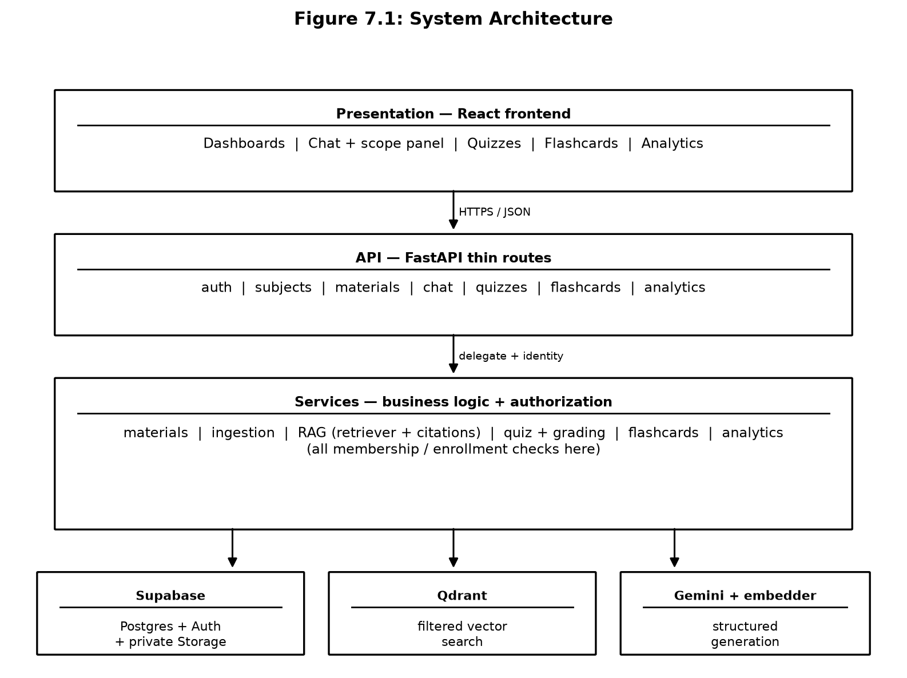
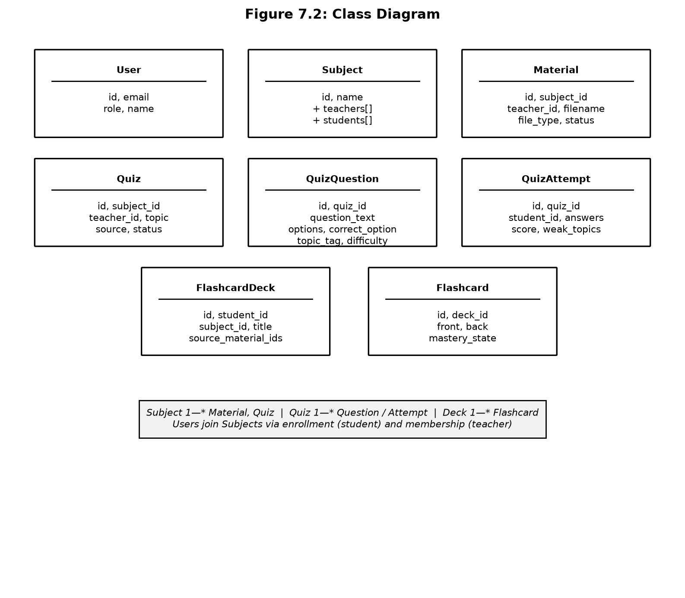
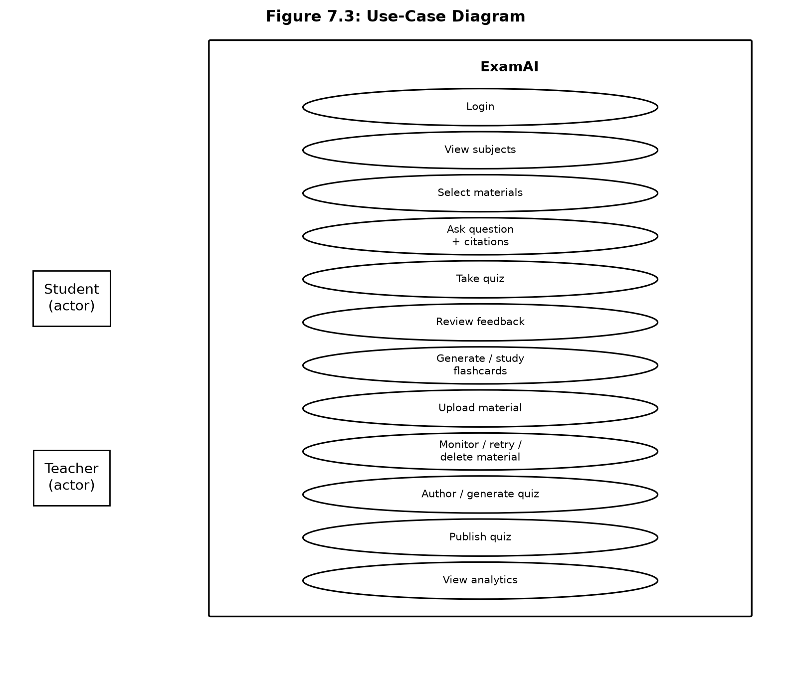
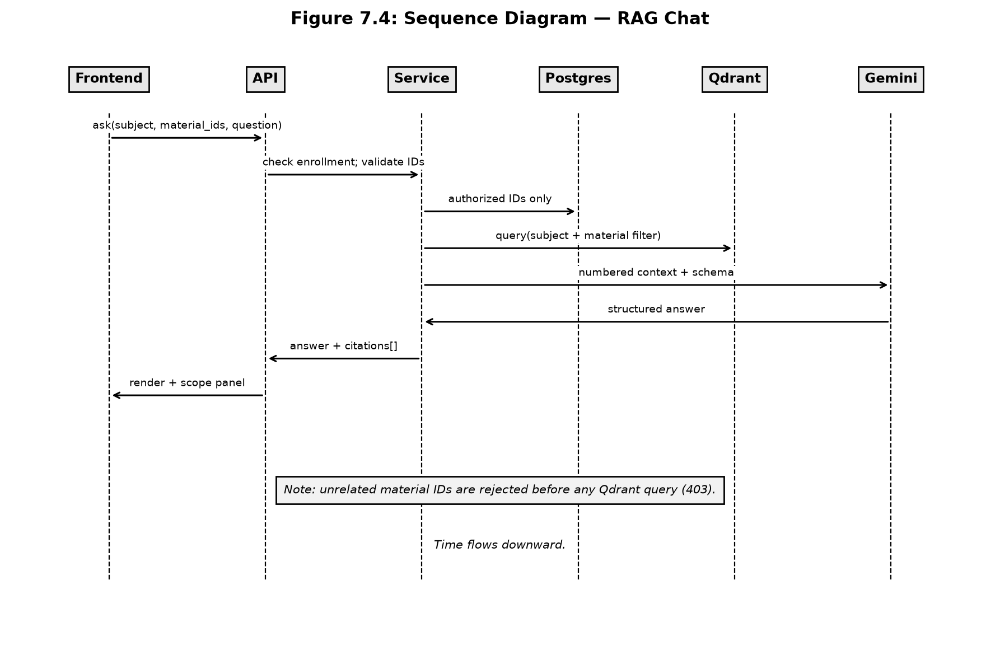
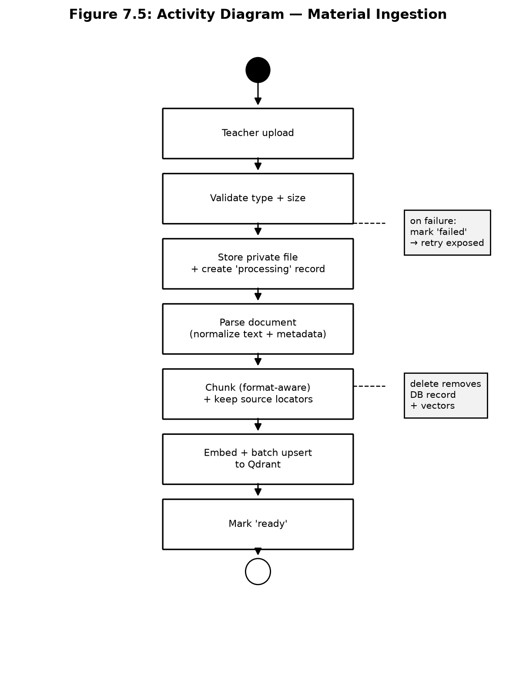
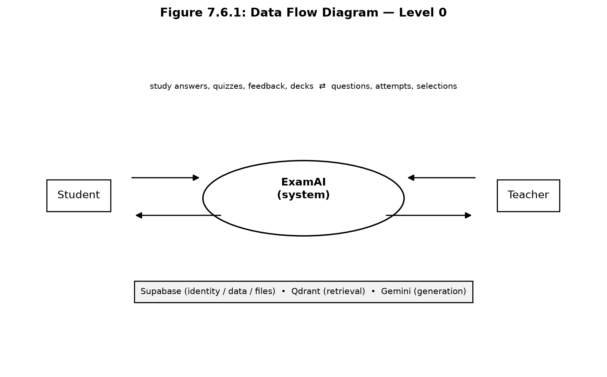
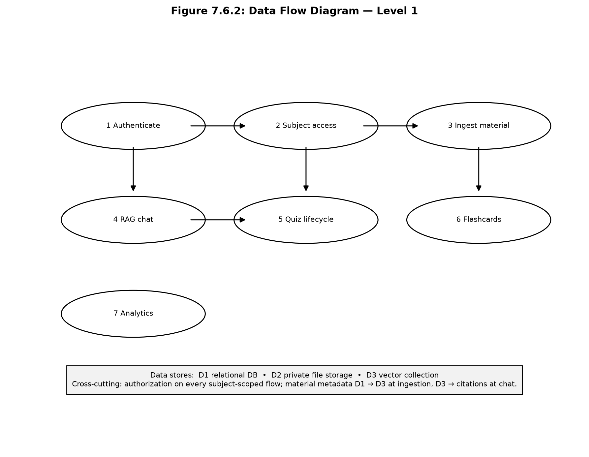

# Chapter 7 — System Design

- SYSTEM ARCHITECTURE
- CLASS DIAGRAM
- USE-CASE DIAGRAM
- SEQUENCE DIAGRAM
- ACTIVITY DIAGRAM
- DATA FLOW DIAGRAM (DFD)
- DATA MODEL

## 7.1 System Architecture

The architecture has a presentation layer, an API and service layer, a relational data layer, a vector retrieval layer, and external AI and storage services. The frontend calls the FastAPI API directly. Route handlers stay thin: they authenticate the request and delegate to services. Services enforce membership, read or write relational state, and call ingestion, retrieval, generation, grading, or analytics components as needed.

| Layer | Responsibilities |
|---|---|
| Frontend | Pages, routing, stores, API client, caching, loading and error states |
| API | Authentication, request validation, standardized response envelope, request IDs |
| Services | Materials, ingestion, RAG chat, quizzes, flashcards, analytics; all authorization |
| Relational data | Users, subjects, memberships, materials, quizzes, attempts, decks |
| Vector + AI | Qdrant filtered retrieval, Gemini structured generation, local embeddings |
| Storage | Private teacher material files, application configuration |

## 7.2 Class Diagram

The domain centres on Subject: teachers join it through membership, students through enrollment; materials and quizzes belong to exactly one subject and one teacher; attempts belong to one student and one quiz; decks belong to one student and record the source material identifiers used at generation time.

## 7.3 Use-Case Diagram

Both roles share the secure authentication boundary; every subject-scoped use case includes a membership/enrollment check.

## 7.4 Sequence Diagram

The sequence below shows one representative interaction — RAG chat — step by step, since this flow touches every layer of the system in a single user action: the frontend sends subject, selected material identifiers, and a question; the service checks enrollment and validates every identifier in Postgres; the question is embedded; Qdrant is queried with subject-plus-material filters; Gemini receives numbered context; the response is parsed; citation markers are mapped to payload metadata; and the API returns answer text plus citations.

## 7.5 Activity Diagram

Material ingestion begins with a teacher upload. The service validates type and size, stores the private file, creates a processing record, parses the document, normalizes text and metadata, chunks content with format-aware windows, creates embeddings, upserts points in batches, and marks the material ready. A failure marks the material failed and exposes retry; deletion removes both the relational record and its vectors. Version-safe status updates prevent stale work from reviving deleted records.

## 7.6 Data Flow Diagram (DFD)

### 7.6.1 Level 0 DFD

At the highest level, students and teachers interact with ExamAI. ExamAI communicates with Supabase for identity, relational data, and file storage; with Qdrant for vector retrieval; and with Gemini for structured generation. The system returns study answers, assessments, feedback, decks, and analytics.

### 7.6.2 Level 1 DFD

The level-one flow separates authentication, subject access, material ingestion, RAG chat, quiz management, flashcard generation, and analytics. Authorization is a cross-cutting control on every subject-scoped flow. Material metadata flows from Postgres into Qdrant payloads during ingestion and returns from Qdrant as citation metadata during chat.

## 7.7 Data Model

The relational model contains users, subjects, subject–teacher membership, student–subject enrollment, materials, quizzes, quiz questions, quiz attempts, flashcard decks, and flashcards. A material belongs to one teacher and one subject; a subject may have multiple teachers. A quiz is teacher-authored and subject-scoped; an attempt belongs to one student and one quiz. A flashcard deck belongs to one student and records its source material identifiers. The per-session material selection is intentionally request-time data, not a table — this keeps "adjustable per session" true at the data layer.
