# Chapter 9 — Result and Discussion

- LOGIN AND ROLE-BASED ACCESS
- STUDENT DASHBOARD AND SUBJECT VIEW
- RAG CHAT WITH MATERIAL SCOPE AND CITATIONS
- QUIZ TAKING AND FEEDBACK
- FLASHCARD GENERATION AND STUDY
- TEACHER MATERIAL MANAGEMENT
- TEACHER QUIZ AUTHORING AND PUBLISHING
- TEACHER ANALYTICS AND STUDENT PROGRESS
- SECURITY AND RELIABILITY RESULTS
- OVERALL SYSTEM PERFORMANCE

ExamAI was built, tested, and verified end to end as a local prototype: every feature described in the earlier chapters works as designed against the offline test suites (82 backend, 63 frontend) plus manual end-to-end passes over a local run. This chapter walks through the finished screens in the order a user meets them, with a short discussion of each one. (Online deployment is planned but not yet carried out, so all screens below are captured from the local build running against seeded demo accounts — the names visible are seed data, not real users.)

## 9.1 Login and Role-Based Access

A provisioned user logs in with email and password; the backend derives the role from the stored profile and the frontend routes to the student or teacher workspace accordingly. The sign-in form offers email and password fields only — there is no signup link and no client-side role selector, so an unregistered email is rejected and an authenticated user can never reach the other role's routes.

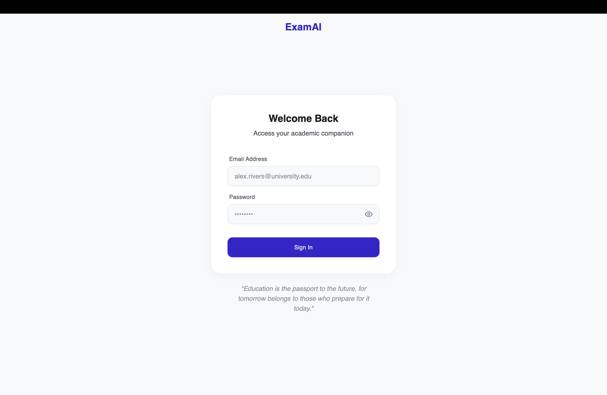

## 9.2 Student Dashboard and Subject View

The student home opens with a study hero panel leading into chat, followed by quick stats (quizzes taken, weak topics, average score) and enrolled-subject cards showing each subject's teachers and the student's progress. The demo account in Figure 9.2 shows three enrolled subjects — including multi-teacher subjects — with per-subject progress bars. The Resources view (Figure 9.3) states the ownership promise directly — "Materials approved by your teachers, grouped by course" — with browse-by-course pills, filter-by-teacher checkboxes, a Recently Added strip, and an All Materials table (name, course, date, size, owner). Only `ready` materials appear in this student-facing list; processing or failed items remain a teacher-side concern.

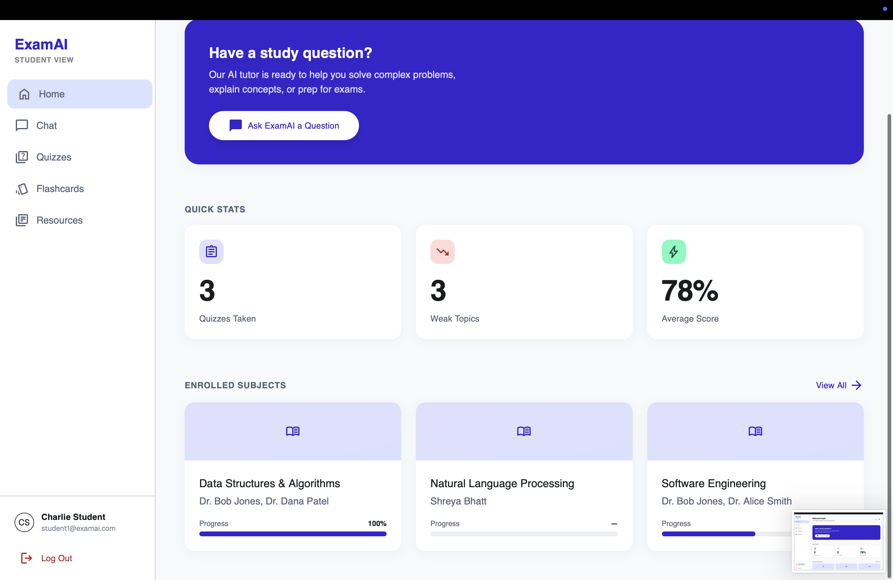

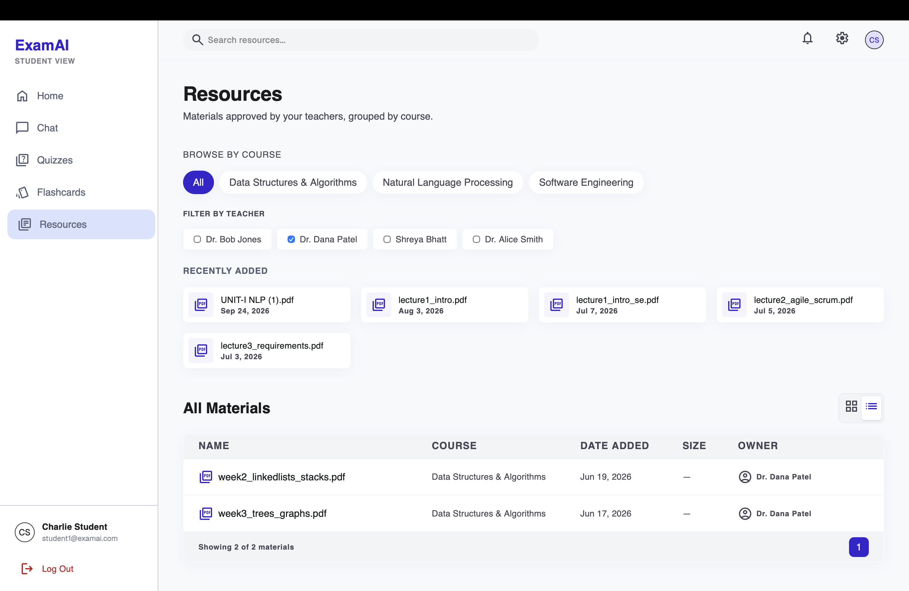

## 9.3 RAG Chat with Material Scope and Citations

The chat view pairs the conversation with a visible study-materials panel: the student ticks which ready materials should ground the session (grouped under the owning teacher's name), with the active count always shown. Answers render with numbered citation markers; hovering a marker reveals the teacher and filename, and a citation footer under each answer names the source explicitly. Figure 9.4 demonstrates both halves of the attribution guarantee: the in-corpus question ("What is NLP") receives a grounded answer citing the teacher's file, while the off-corpus question ("who is Donald trump") is refused with "The provided context is insufficient…" instead of hallucinated — the system answers only from approved material.

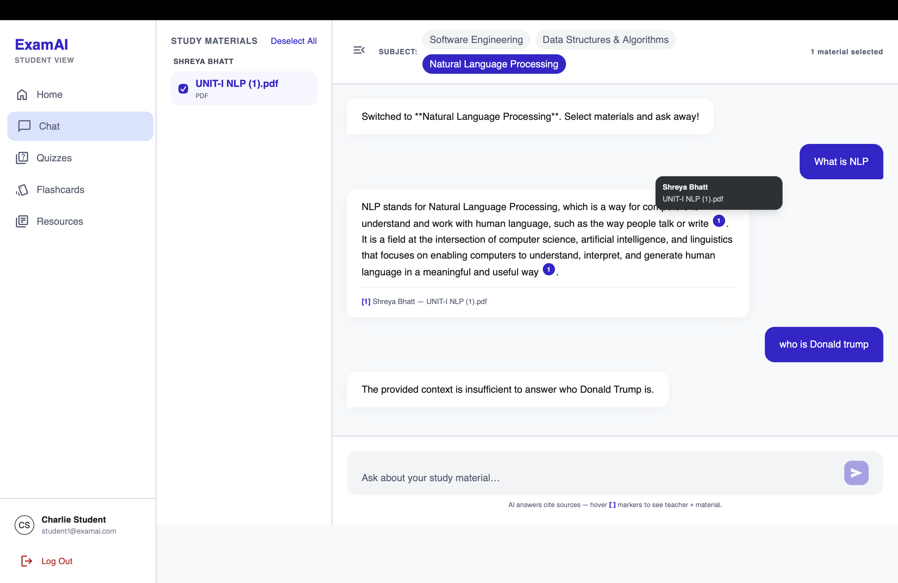

## 9.4 Quiz Taking and Feedback

The quiz list (Figure 9.5) shows four published quizzes across the student's subjects, each naming its authoring teacher: completed ones carry a Completed badge with the score and a View Results action, while the unattempted one offers Start Quiz. Taking a quiz (Figure 9.6) presents one question at a time under a visible countdown timer with Previous/Next navigation and progress dots. On submission the server grades the attempt and returns a grade card (Figure 9.7 shows a D at 50%, 3 of 6 correct) with an "Areas to Review" breakdown by topic tag (SDLC 67%, Requirements 33%), followed by a full question review (Figure 9.8) marking each response — the student's wrong pick highlighted in red against the correct choice in green, as seen in Q2 where the chosen distractor and the correct answer are shown side by side. Re-submitting an attempt is idempotent — the score is not duplicated.

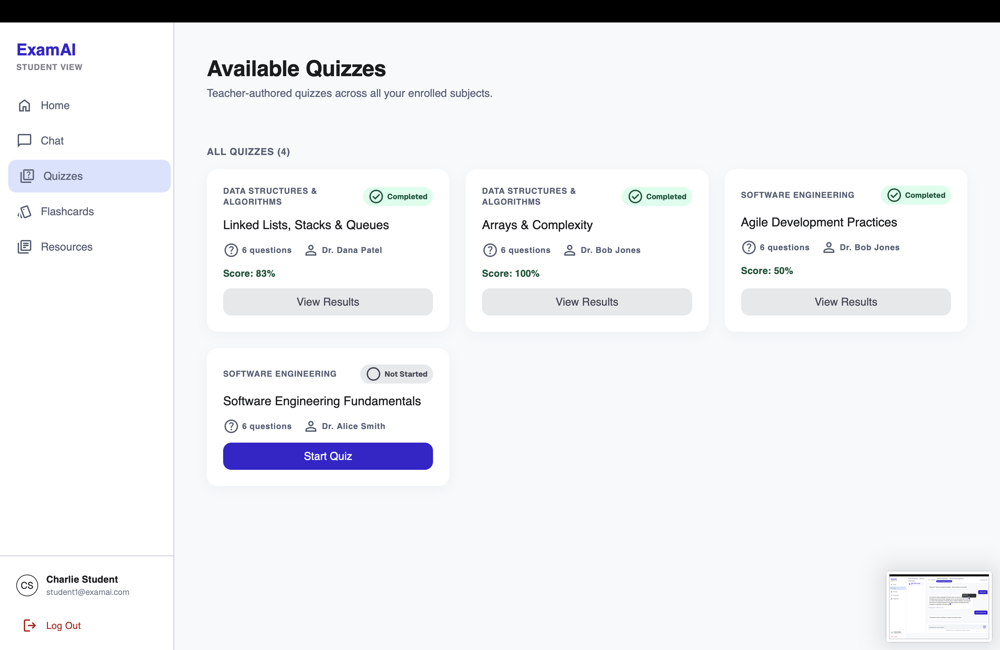

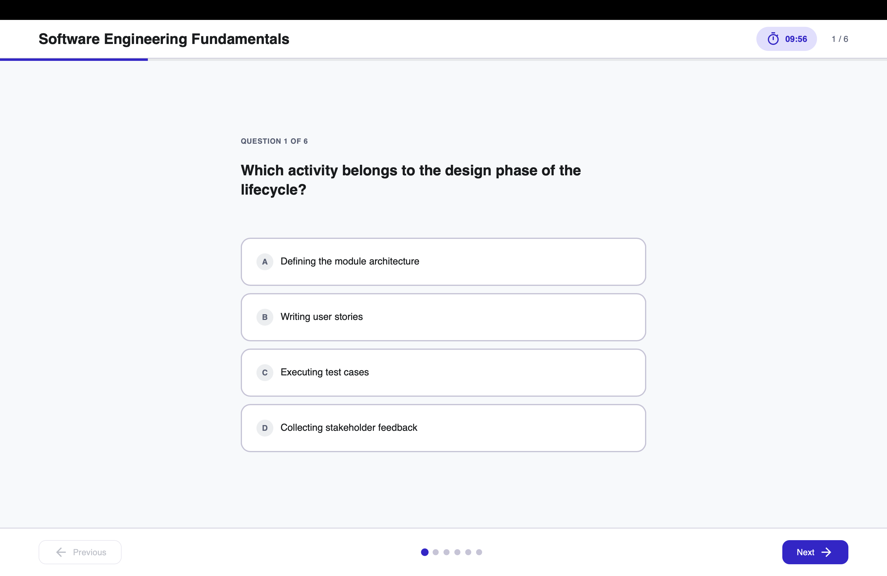

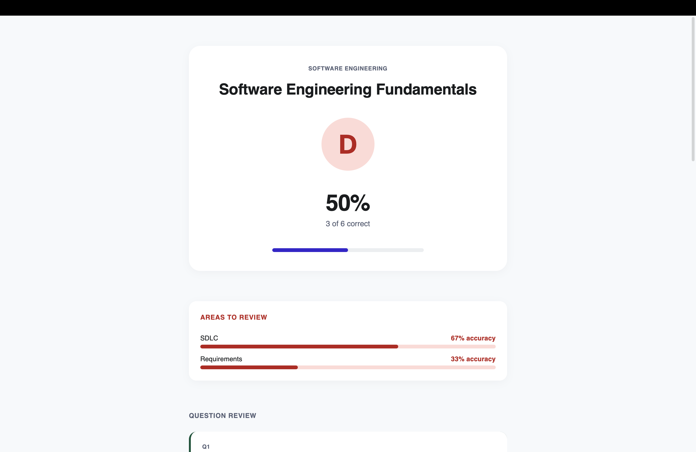

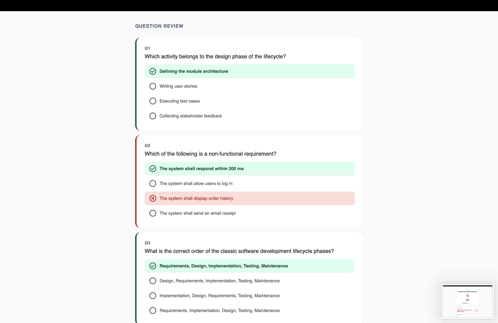

## 9.5 Flashcard Generation and Study

From any selected material set the student generates a named deck via the Generate New Deck action; the deck list (Figure 9.9) shows two personal decks with card counts, mastered counts, and mastery bars (8 cards / 4 mastered / 50%; 10 cards / 3 mastered / 30%). Cards are studied in a flip view (Figure 9.10 shows card 1 of 8 in "Data Structures Quick Cards" with tap-to-reveal) and marked still-learning or mastered, moving the card between `new`, `learning`, and `mastered` states. Decks are personal to the student and record the source material identifiers used at generation, so a deck can always be traced back to what it was built from.

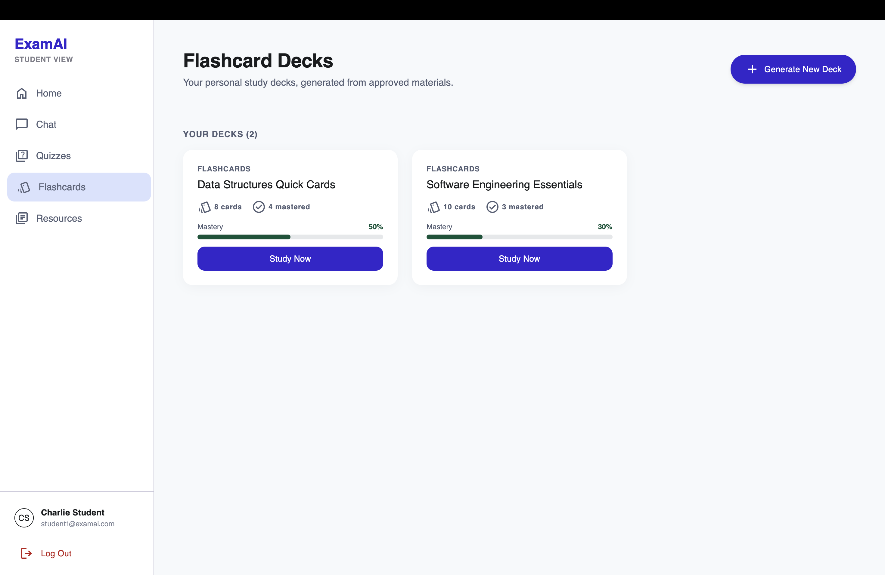

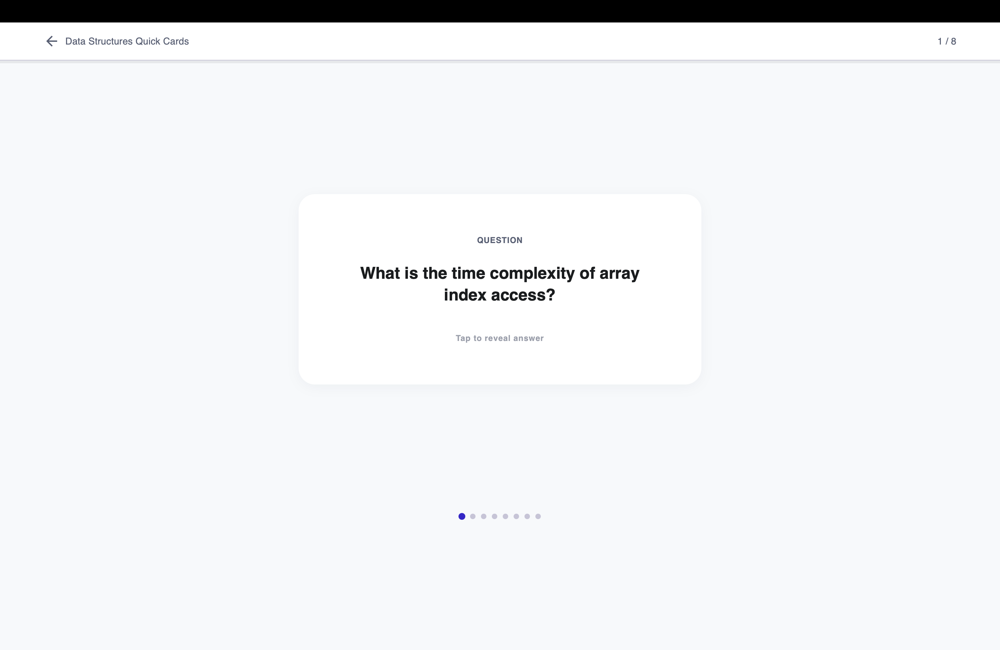

## 9.6 Teacher Material Management

The teacher materials view ("Resources & Materials") states its sharing rule directly: "Co-teacher materials are visible but read-only." A drag-and-drop upload zone accepts PDF, PPTX, and DOCX with per-subject tabs, and the All Materials table lists file, subject, owner, status, and upload date. The Owner column distinguishes the teacher's own files ("You", editable) from a co-teacher's (visible only), and the captured rows show Ready badges — the `processing` and `failed` states with retry, plus deletion, are handled by the same pipeline (Section 8.5) and covered in testing (Chapter 7).

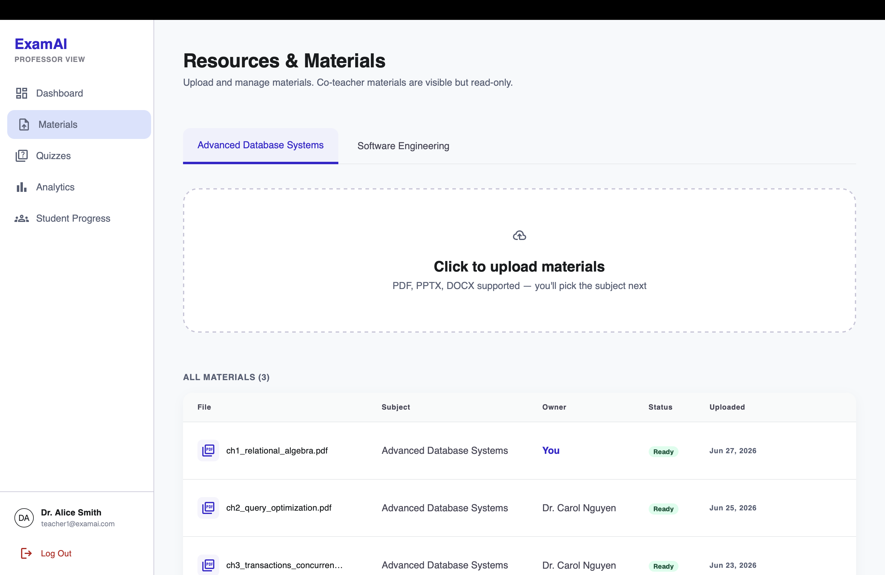

## 9.7 Teacher Quiz Authoring and Publishing

The quiz list states the fairness rule directly: "All students in a subject take the same published quiz." Each card carries a Draft/Published badge and a Manual/AI source tag, with Edit, Publish, and delete actions — drafts expose a Publish button while published quizzes do not. Teachers author manually question by question, or request an AI-assisted draft generated from ready material; both paths produce the same question shape, and AI drafts remain drafts until reviewed and published.

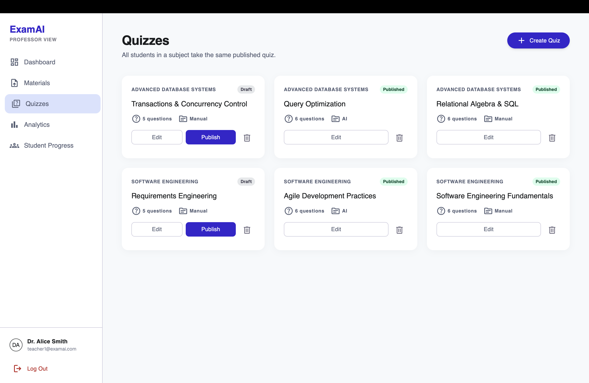

## 9.8 Teacher Analytics and Student Progress

The analytics design deliberately separates per-quiz analysis from cross-quiz student progress. The per-quiz view (Figure 9.13, captured on a 17-student class with 16/17 completion and a 79% average) shows a question-accuracy heatmap with a Good/OK/Weak/Poor key, an A–F grade distribution, and the derived weak topic ("Indexing" at 69% class accuracy) — answering "how did this quiz go?". The student progress roster (Figure 9.14) lists every student with average score, completion bar, last-active date, and an At Risk / On Track badge, with a "7 at-risk" summary counter, name search, and subject filter on top and a drill-down chevron per row — answering "how is this student doing?". The teacher dashboard (Figure 9.15) adds an at-a-glance overview: active students, subject materials, quizzes created, and average section score (22 / 7 / 6 / 70% in the capture), with a recent-activity feed of who completed which quiz at what score, a grade-distribution summary, and an AI-insights card. Keeping these read models separate avoids forcing two different questions into one overloaded query.

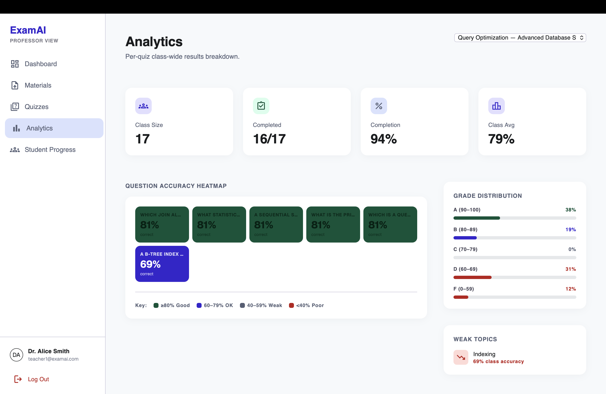

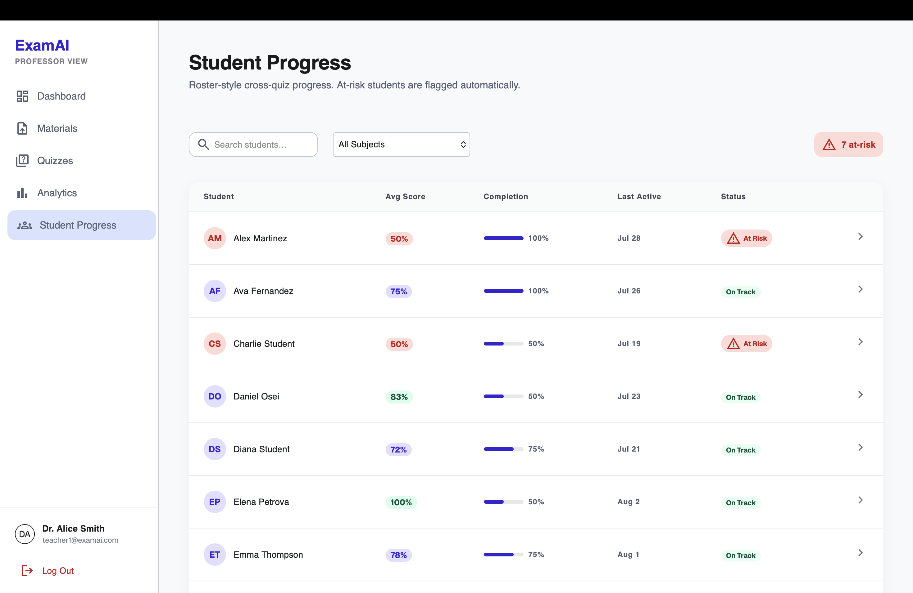

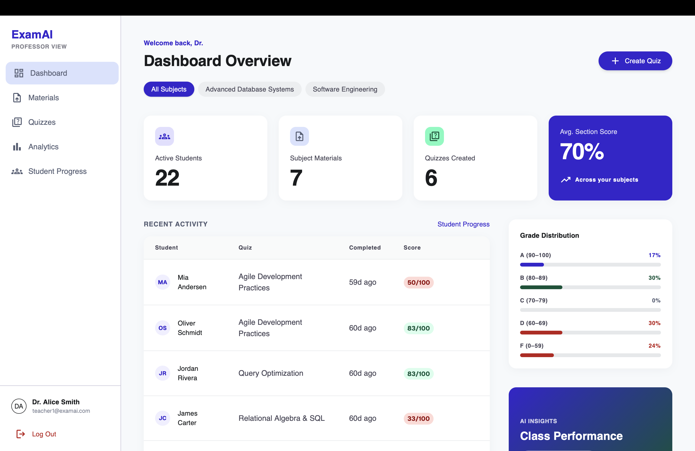

## 9.9 Security and Reliability Results

Access tokens are kept in memory with a HttpOnly refresh cookie; the API client performs one silent refresh-and-replay after a 401 before redirecting to login. CORS uses an allow-list and storage paths are never serialized to clients. Authorization checks are repeated in services rather than relying on route declarations alone. The ingestion pipeline uses per-material locks, row-level guards, and version-safe updates, with blocking parser and embedding calls moved off the event loop. Structured generation uses Pydantic schemas as the output contract, retrying with the error, the bad response, and the schema on failure. These patterns improve reliability without pretending external AI services are deterministic.

## 9.10 Overall System Performance

The backend suite (82 tests) runs fully offline in under a second; the frontend suite (63 tests) runs under Vitest with route, store, and component coverage. Frontend performance work includes route-level code splitting, navigation prefetching, bounded safe-GET caching, concurrent request deduplication, debounced search, loading skeletons, and stale-response handling — targeting measured responsiveness while preserving correctness. The known performance caveat is dependence on hosted services (database, vector store, model API) at deployment time: latency and quota there are deployment properties, and online hosting remains planned future work (Chapter 10).
